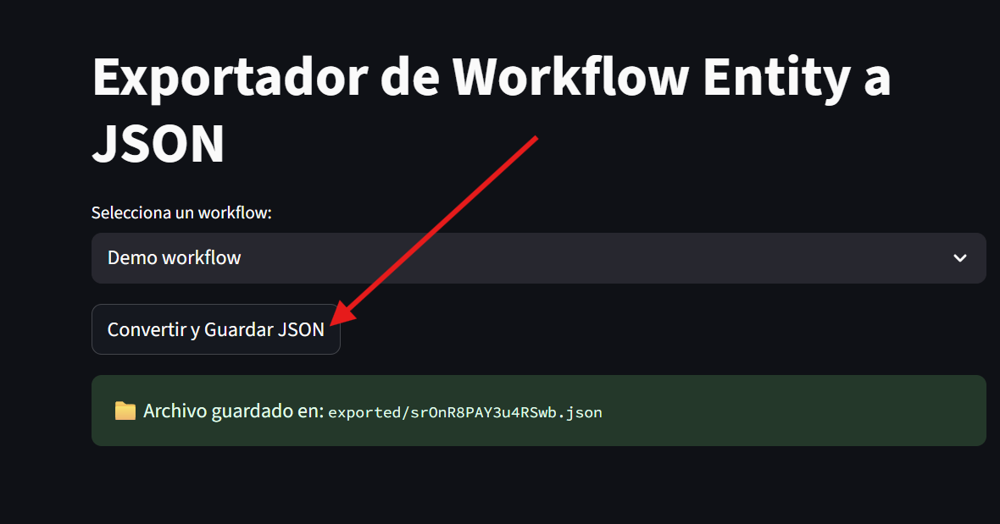

start the project with compose

```sh
docker compose --profile gpu-nvidia build
```

```sh
docker compose --profile gpu-nvidia up
```

add the `nomic-embed-text` model to create embedding

```sh
docker exec -it ollama ollama pull nomic-embed-text
```

```sh
curl http://ollama:11434/api/embeddings \
  -H "Content-Type: application/json" \
  -d '{
    "model": "nomic-embed-text",
    "prompt": "Texto de ejemplo para embedding"
  }'

```

go to `localhost:5801` and search for your workflow. Save it. Then you use your git tool to have control over the changes you have made.



delete everything once you are done

```sh
docker compose down -v
```